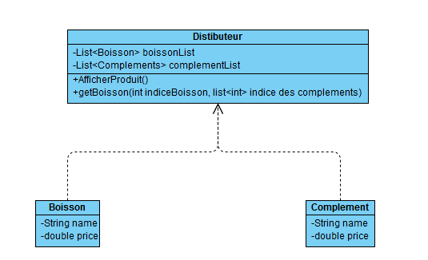

**Nom/Prénom Etudiant 1 :**

# Rapport TP2a

### Itération 2

*J'ai créer une classe distributeur qui contient une liste des boissons et une liste des complements en attribut. Les boissons et complement ont un nom et un prix. Le distributeur affiche les boissons et les compléments. La création dus distributeur et des boissons/compléments se fait dans le main.*
*L'ajout d'élément est plutot simple, il suffit de créer l'élément dans le main et de l'ajouter à la liste utilisé pour créer le distributeur.*
* J'aurai mieu fait de fait une classe mère commune entre les boissons et els complément pour ne pas réécrire du code. Je pourrai aussi ajouter une fonctions pour ajouter une boisson ou un complément après la création du distributeur*

### Itération 3

*J'ai créer une classe abstaite ProduitComposent qui à un attribut name et un attribut price avec les getteur. Les attribut sont en protected pour etre accessible aux classes filles. Les classes filles sont les boissons qui contiennent seulement un contructeur qui fixe le name et le price. La dernière classe fille est une classe abstraite décorateur. Elle a trois attributs, un ProduitComposant, un nomb et un prix. Cette classe est hérité par les compléments. Cette classe refini les méthode getName et getPrice. pour getName, elle fait la concaténation entre p.getname et Nom. Pour getPrice, elle renvoie la somme entre p.getPrice et prix. La classe Décorateur est hérité par les compléments. Les compléments possèdent seulement un constructeur qui défini le Nom du complément et son prix. Il est très facile d'ajouter des boissons ou des compléments, il faut juste ajouter une nouvelle classe qui hérite ProduitComposent ou Decorateur.*
*Le Design pattern décorateur est très utile lorsque on prévoir des changements conséquent dans les objet. Il permet d'ajouter dynamiquement des fonctionnalité sans perturbé les classes qui l'utilisent ou en héritent.*

