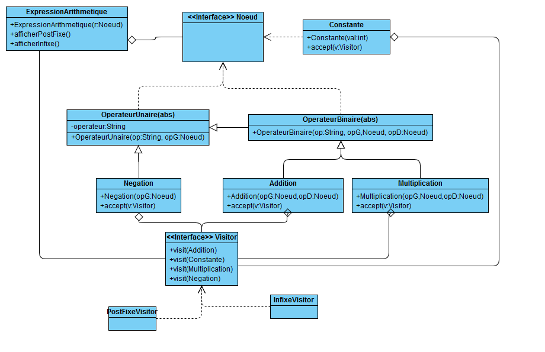

**Nom/Prénom Etudiant 1 :**

# Rapport TP2b

## Question 2
*Le seul moyen d'ajouter des opérations sur l'expression arithmétique est d'ajouter la nouvelle opération à toute les classes opérateurs.*

## Question 3

*Ajout de l'interface Visitor et des classe PostFixeVisitor et InfixeVisitor. Les différents noeuds ont maintenant une fonction accept qui prend un visiteur et le lance sur lui même avec visit(this). Les fonctions d'affichage dans ExpressionArithmetique utilise accept sur la racine avec le Visitor qui convient.*

## Question 8
*Il est très facile d'ajouter des opération à l'expression arithmetique, il suffit de créer un nouveau visiteur qui effectue l'opération et de créer une nouvelle fonction dans la classe ExpressionArithmetique qui attribut le visiteur à la racine.*
*Il est égalemnt facile d'ajouter des type de Noeud en créant une nouvelle classe qui hérite de l'interface Noeud. Cette nouvelle classe peut alors être utilisée dans la création des expressions arithmetique.*

